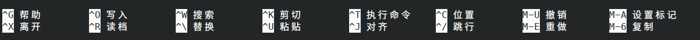

# 开始之前

由于 UEFI 已普及数年，故本教程全部使用 UEFI+GPT 的形式进行，BIOS 方式自行搜索解决。

## 终端编辑器 nano 的使用

在安装 Arch Linux 的过程中，终端编辑器的使用是不可避免的，如果你从来没有使用过终端编辑器，本节做一个简单的介绍，如果你使用过可以直接跳过本节。

与其它教程不同的是，本文推荐使用 nano 编辑器，vim 虽然是著名的终端编辑器，但是其上手难度较大，不适合新手第一次使用。如果你没有一个可用的 Linux 环境用于实践，这里推荐一个在线环境 [copy.sh](https://copy.sh/v86/?profile=archlinux)，由于其是在线环境，故性能较差，执行命令请耐心等待。如无特殊说明，本文后续终端编辑器默认为 nano。

```bash
nano test.txt		# 创建并编辑名为 test.txt 的文件
```

你可以看到进入了一个空的界面，下方有一些使用提示，这里提供一个翻译图片用作简单对照。其中`^`表示<kbd>Ctrl</kbd>键，比如`^G`表示<kbd>Ctrl</kbd>+<kbd>G</kbd>组合按键；`M`表示<kbd>Alt</kbd>键，比如`M-6`表示<kbd>Alt</kbd>+<kbd>6</kbd>组合按键。



## 准备网络环境

如果你使用有线网络，并设置为自动分配网络地址（DHCP），那么你无需任何操作。

如果你使用无线网络，那么需要确保你的 Wi-Fi 名称不包含任何中文字符，因为安装时的终端无法显示任何中文字符，你也无法正常输入任何中文。虽然有一些办法可以支持中文，但其过于繁琐，在安装时没有必要这么做。

## 下载安装镜像

你需要下载 Arch Linux 的基础安装镜像来制作启动 U 盘并安装系统，如果你可以正常的访问 Google 等服务，那么推荐你从该网站下载：[Worldwide](https://geo.mirror.pkgbuild.com/iso/latest/archlinux-x86_64.iso)；如果你身处中国大陆，那么推荐你从该网站下载：[清华大学开源软件镜像站](https://mirrors.tuna.tsinghua.edu.cn/archlinux/iso/latest/archlinux-x86_64.iso)。下载完成后，我们需要验证文件的完整性。

我们非常推荐你使用 OpenPGP 对文件进行签名验证，这可以确保你下载的镜像是完整的，未经篡改的，无错误的。你可以在此链接获得镜像的 OpenPGP 签名文件：[Arch Linux: PGP signature](https://archlinux.org/iso/latest/archlinux-x86_64.iso.sig)。将该文件与镜像放在同一目录下，使用如下命令验证：

```bash
gpg --keyserver-options auto-key-retrieve --verify archlinux-x86_64.iso.sig
```

在输出信息中包含 ”**完好的签名**“ 或者 ”**Good signature**“ 字样即可认为你的镜像是正确的。

我们也可以使用 SHA256 值进行验证，你可以在这里找到正确的文件校验值：[Arch Linux: sha256sum.txt](https://archlinux.org/iso/latest/sha256sums.txt)。

对于 Windows 系统，可以使用系统自带的 PowerShell 进行验证，命令如下：

```powershell
Get-FileHash archlinux-x86_64.iso -Algorithm SHA256 | Format-List
```

对于 Linux 和 macOS 系统，可以直接使用系统自带终端进行验证，命令如下：

```bash
sha256sum archlinux-x86_64.iso
```

将得到的 SHA256 值与官方给出的进行对比，如果一致即可认为你的镜像是正确的。

## 制作启动 U 盘

**==警告：本文推荐的制作启动 U 盘方法会导致 U 盘内数据全部清空！！请务必确认 U 盘内无重要文件！！==**

你需要一个空间大于 2GB 的 U 盘，将其格式化为 FAT32 格式。

将下载的镜像挂载或使用压缩文件管理工具打开，将其中全部的内容复制到 U 盘根目录下即可。

我们不推荐使用 etcher 之类的 U 盘制作工具进行启动盘的制作，它们均会不同程度的改变 ISO 的数据，有可能导致某些环境下启动失败。

## 准备你的电脑

插入你的 U 盘并开机，在开机时进入 BIOS 进行设置。你需要在开机时按下 <kbd>ESC</kbd> / <kbd>F2</kbd> / <kbd>F10</kbd> / <kbd>F12</kbd> / <kbd>Delete</kbd> 等按键（具体取决于你的主板制造商，请查阅官网或说明书）。你需要修改以下选项：

- 关闭 **安全启动（Secure Boot）**
- 修改启动模式为 **UEFI**
- 将 U 盘调整到第一位启动顺序

保存设置并重启电脑，如果一切顺利，那么你将进入 Arch Linux 安装界面。
